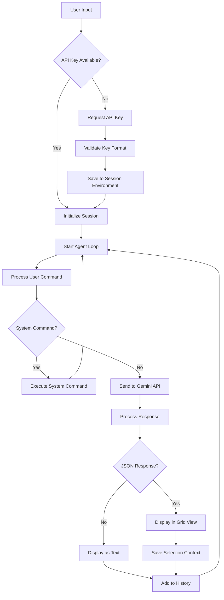
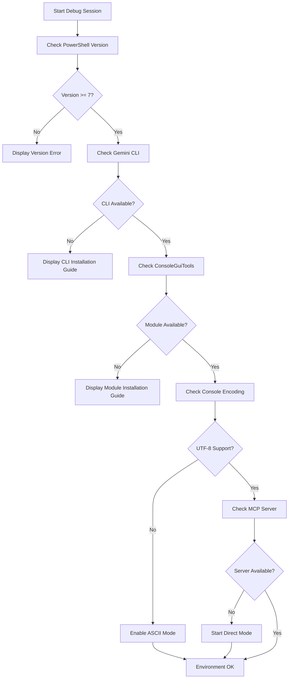
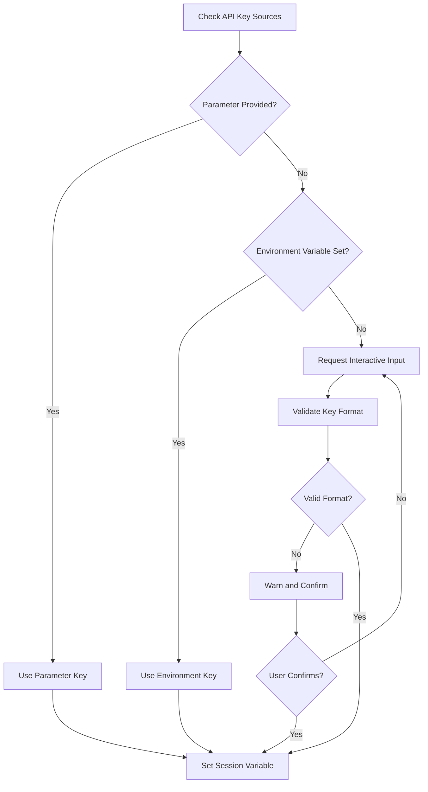
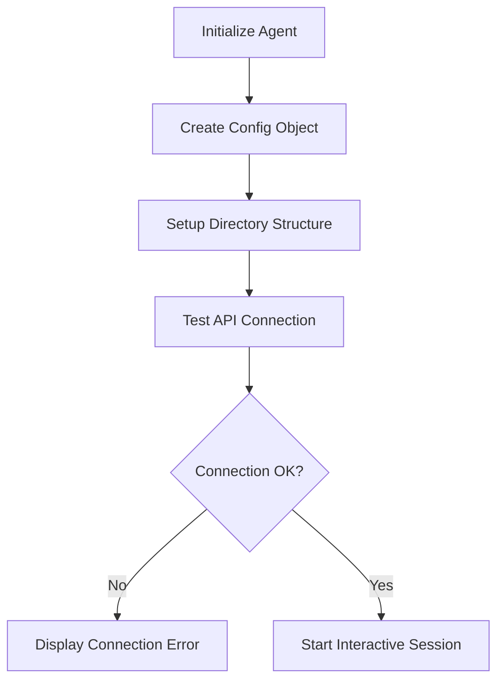

# SmartAgents PowerShell Framework - Debug and Execution Design

## Overview

This design document outlines the debugging, error handling, and execution procedures for the SmartAgents PowerShell Framework, specifically focusing on running the Start-FindSpecAgent with proper API key management and troubleshooting common issues.

## Technology Stack & Dependencies

### Core Requirements
- **PowerShell**: Version 7+ (critical requirement)
- **Gemini CLI**: Command-line interface for Google Gemini API
- **Microsoft.PowerShell.ConsoleGuiTools**: Required for `Out-ConsoleGridView` functionality
- **Google Gemini API Key**: Authentication for AI services

### API Models Supported
- `gemini-2.5-pro`: Enhanced model for complex queries
- `gemini-2.5-flash`: Default fast model for general use

## Architecture

### Component Hierarchy
```
SmartAgents Framework
├── Core Module (SmartAgents.psm1)
│   ├── Configuration Management
│   ├── Session Initialization  
│   ├── Gemini API Integration
│   ├── JSON Processing
│   └── History Management
├── Find-Spec Agent (Find-Spec.ps1)
│   ├── API Key Management
│   ├── Interactive Session
│   ├── Command Processing
│   └── Results Display
└── Agent Configuration (.gemini/)
    ├── GEMINI.md (System Instructions)
    ├── ShowHelp.md (User Help)
    └── settings.json (Configuration)
```

### Data Flow Architecture


## Debugging & Error Handling Strategy

### Critical Error Categories

#### 1. System Prerequisites Issues
**Error**: PowerShell version compatibility
```powershell
if ($PSVersionTable.PSVersion.Major -lt 7) {
    throw "Требуется PowerShell 7+. Текущая версия: $($PSVersionTable.PSVersion)"
}
```

**Error**: Missing Gemini CLI
```powershell
try {
    $geminiVersion = & gemini --version 2>&1
} catch {
    throw "Gemini CLI не найден в PATH. Убедитесь, что он установлен."
}
```

**Error**: Missing ConsoleGuiTools
```powershell
try {
    Get-Command Out-ConsoleGridView -ErrorAction Stop | Out-Null
} catch {
    throw "Out-ConsoleGridView недоступен. Установите модуль Microsoft.PowerShell.ConsoleGuiTools."
}
```

#### 2. UI Display & Console Formatting Issues
**Error**: Console encoding problems
- **Detection**: Malformed box-drawing characters in agent banner (line 239)
- **Resolution**: Ensure console supports UTF-8 encoding
- **Fallback**: Provide ASCII-only display mode

**Error**: Color display issues
- **Detection**: Colors not rendering properly in terminal
- **Resolution**: Validate terminal capabilities and provide monochrome fallback

#### 3. API Key Management Issues
**Error**: Missing API Key
- **Detection**: Check `$env:GEMINI_API_KEY`, parameters, and user input
- **Resolution**: Interactive key request with validation
- **Session Management**: Store only in current session environment

**Error**: Invalid API Key Format
- **Detection**: Length < 20 characters or invalid character pattern
- **Resolution**: Format validation with user confirmation option

#### 4. Gemini API Communication Issues
**Error**: Quota Exceeded (429)
```powershell
if ($outputString -match "429" -or $outputString -match "Quota exceeded") {
    Write-ColoredMessage "Превышена квота Google Gemini (Ошибка 429)." -Color $Config.Color.Error
    # Provide troubleshooting guidance
}
```

**Error**: Network/Authentication Issues
- **Detection**: Non-zero exit codes from Gemini CLI
- **Resolution**: Comprehensive error message with troubleshooting steps

#### 5. MCP Server Integration Issues
**Error**: MCP Server Connection Failure
- **Detection**: Server unavailable on port 8090
- **Resolution**: Check server status, restart if needed
- **Fallback**: Direct Gemini CLI mode without MCP

**Error**: PowerShell Command Execution Timeout
- **Detection**: MCP server timeout responses
- **Resolution**: Implement command timeout handling
- **Recovery**: Graceful degradation to direct mode

### Comprehensive Error Handling Procedures

#### Error Handler Framework
```powershell
function Handle-AgentError {
    param(
        [string]$ErrorType,
        [string]$ErrorMessage,
        [hashtable]$Context,
        [string]$RecoveryAction = 'Continue'
    )
    
    $timestamp = Get-Date -Format "yyyy-MM-dd HH:mm:ss"
    $logEntry = @{
        Timestamp = $timestamp
        ErrorType = $ErrorType
        Message = $ErrorMessage
        Context = $Context
        RecoveryAction = $RecoveryAction
    }
    
    # Log error to file
    $logEntry | ConvertTo-Json | Add-Content -Path $Config.ErrorLogPath
    
    # Display formatted error
    Write-Host "╔══════════════════════════════════════════════════════════════════════════════╗" -ForegroundColor Red
    Write-Host "║                                    ERROR                                     ║" -ForegroundColor Red
    Write-Host "╠══════════════════════════════════════════════════════════════════════════════╣" -ForegroundColor Red
    Write-Host "║  Type: $($ErrorType.PadRight(69))║" -ForegroundColor White
    Write-Host "║  Time: $($timestamp.PadRight(69))║" -ForegroundColor White
    Write-Host "║  Message: $($ErrorMessage.PadRight(64))║" -ForegroundColor Yellow
    Write-Host "╚══════════════════════════════════════════════════════════════════════════════╝" -ForegroundColor Red
    
    switch ($RecoveryAction) {
        'Exit' { exit 1 }
        'Retry' { return 'retry' }
        'Continue' { return 'continue' }
        'Fallback' { return 'fallback' }
    }
}
```

### Debugging Workflow

#### Step 1: Environment Validation


#### Step 2: API Key Configuration


#### Step 3: Agent Initialization


## Common Issues & Resolutions

### Issue 1: Port Conflicts (MCP Server)
**Problem**: MCP server port 8090 in use
**Detection**: Server startup failure with port binding error
**Resolution Strategy**:
```powershell
function Test-MCPServerPort {
    param([int]$Port = 8090)
    try {
        $listener = [System.Net.Sockets.TcpListener]::new([System.Net.IPAddress]::Any, $Port)
        $listener.Start()
        $listener.Stop()
        return $true
    } catch {
        return $false
    }
}

if (-not (Test-MCPServerPort)) {
    Write-Warning "Port 8090 in use. Switching to direct Gemini CLI mode."
    $Config.UseMCP = $false
}
```

### Issue 2: Module Loading Failures
**Problem**: Agent scripts not found or corrupted
**Detection**: Module import errors during agent initialization
**Resolution**: Enhanced path validation and recovery
```powershell
function Validate-AgentFiles {
    param([string]$AgentPath)
    $requiredFiles = @('Find-Spec.ps1', '.gemini/GEMINI.md', '.gemini/ShowHelp.md')
    $missingFiles = @()
    
    foreach ($file in $requiredFiles) {
        $fullPath = Join-Path $AgentPath $file
        if (-not (Test-Path $fullPath)) {
            $missingFiles += $file
        }
    }
    
    if ($missingFiles.Count -gt 0) {
        throw "Missing agent files: $($missingFiles -join ', ')"
    }
}
```

### Issue 3: JSON Processing Errors
**Problem**: Invalid JSON responses from Gemini API
**Detection**: ConvertFrom-Json exceptions during response parsing
**Resolution**: Robust JSON parsing with fallback modes
```powershell
function Parse-GeminiResponse {
    param([string]$Response)
    
    # Try direct JSON parsing
    try {
        return $Response | ConvertFrom-Json
    } catch {
        # Try extracting JSON from markdown code blocks
        if ($Response -match '(?s)```json\s*(.*?)\s*```') {
            try {
                return $matches[1] | ConvertFrom-Json
            } catch {
                Write-Warning "Failed to parse JSON from code block"
            }
        }
        
        # Fallback to text mode
        Write-Host "Response parsing failed, displaying as text:" -ForegroundColor Yellow
        return $null
    }
}
```

### Issue 4: History File Access
**Problem**: Cannot write to history directory due to permissions
**Detection**: File system permission errors during session initialization
**Resolution**: Graceful degradation with alternative storage
```powershell
function Initialize-HistoryStorage {
    param([string]$PreferredPath)
    
    try {
        if (-not (Test-Path $PreferredPath)) {
            New-Item -Path $PreferredPath -ItemType Directory -Force
        }
        # Test write access
        $testFile = Join-Path $PreferredPath "test_write.tmp"
        "test" | Out-File -FilePath $testFile
        Remove-Item $testFile
        return $PreferredPath
    } catch {
        # Fallback to temp directory
        $tempPath = Join-Path $env:TEMP "SmartAgents_History"
        try {
            if (-not (Test-Path $tempPath)) {
                New-Item -Path $tempPath -ItemType Directory -Force
            }
            Write-Warning "Using temporary history storage: $tempPath"
            return $tempPath
        } catch {
            Write-Warning "History storage disabled due to file system restrictions"
            return $null
        }
    }
}
```

### Issue 5: Console Formatting Errors (Line 239 Context)
**Problem**: Box-drawing characters not displaying correctly
**Detection**: Terminal encoding issues affecting UI elements
**Resolution**: Console compatibility detection and fallback
```powershell
function Test-ConsoleCapabilities {
    $testChars = @('╔', '║', '╚', '═')
    foreach ($char in $testChars) {
        try {
            [Console]::Write($char)
            [Console]::SetCursorPosition([Console]::CursorLeft - 1, [Console]::CursorTop)
            [Console]::Write(' ')
        } catch {
            return $false
        }
    }
    return $true
}

function Show-AgentBanner {
    param([hashtable]$Config, [bool]$UseAscii = $false)
    
    if ($UseAscii -or -not (Test-ConsoleCapabilities)) {
        # ASCII fallback banner
        Write-Host "+==============================================================================+" -ForegroundColor Green
        Write-Host "|                    🔍 AI-ПОИСКОВИК СПЕЦИФИКАЦИЙ                             |" -ForegroundColor Green
        Write-Host "+==============================================================================+" -ForegroundColor Green
    } else {
        # UTF-8 box drawing characters (original line 239 context)
        Write-Host "╔══════════════════════════════════════════════════════════════════════════════╗" -ForegroundColor Green
        Write-Host "║                    🔍 AI-ПОИСКОВИК СПЕЦИФИКАЦИЙ                             ║" -ForegroundColor Green
        Write-Host "╠══════════════════════════════════════════════════════════════════════════════╣" -ForegroundColor Green
    }
}
```

## Testing Strategy

### Unit Testing Approach
1. **API Key Validation Tests**
   - Valid key formats
   - Invalid key handling
   - Empty key scenarios

2. **Configuration Tests**
   - Directory creation
   - Path resolution
   - Permission validation

3. **Gemini Integration Tests**
   - API connectivity
   - Response parsing
   - Error handling

### Integration Testing
1. **End-to-End Agent Flow**
   - Complete session lifecycle
   - Command processing
   - History management

2. **Error Recovery Tests**
   - Network interruption handling
   - Invalid response processing
   - Session restoration

## Security Considerations

### API Key Management
- **Session-Only Storage**: Never persist API keys to permanent storage
- **Masked Display**: Show only partial key information in logs
- **Secure Transmission**: Use environment variables for CLI communication

### Input Validation
- **Command Sanitization**: Validate system commands before execution
- **JSON Parsing**: Safe JSON processing with error handling
- **Path Validation**: Secure file path handling for history and config

## Performance Optimization

### Response Time Optimization
- **Model Selection**: Use `gemini-2.5-flash` for faster responses
- **Caching Strategy**: Implement session-based response caching
- **Timeout Management**: Set appropriate timeouts for API calls

### Memory Management
- **History Limits**: Implement history file size limits
- **Session Cleanup**: Proper disposal of temporary resources
- **Streaming Responses**: Handle large API responses efficiently

## Configuration Management

### Agent Configuration Structure
```json
{
  "AgentRoot": "path/to/agent",
  "HistoryDir": "path/to/history", 
  "ConfigDir": "path/to/config",
  "SessionPrefix": "session_prefix",
  "AppName": "Agent Name",
  "Emoji": "🔍",
  "Color": {
    "Success": "Green",
    "Warning": "Yellow", 
    "Info": "Cyan",
    "Error": "Red",
    "Prompt": "Green",
    "Selection": "Magenta",
    "Processing": "Gray"
  }
}
```

### Session Management
- **History Format**: JSONL format for chat history
- **Session Naming**: Timestamp-based unique session identifiers
- **Cleanup Strategy**: Automatic cleanup of old sessions

## Deployment Considerations

### Installation Requirements
1. Run `install.ps1` with API key parameter
2. Import module: `Import-Module .\SmartAgents.psd1`
3. Verify prerequisites with system checks

### Runtime Environment
- **Execution Policy**: Ensure PowerShell execution policy allows script execution
- **Network Access**: Verify connectivity to Google Gemini API endpoints
- **File Permissions**: Ensure write access to history and config directories

### Monitoring & Logging
- **Session Logging**: Comprehensive logging of agent interactions
- **Error Tracking**: Detailed error information for troubleshooting
- **Performance Metrics**: Track API response times and success rates